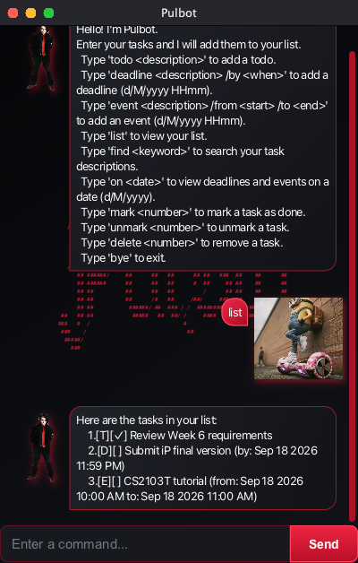

# Pulbot User Guide

Pulbot is a desktop task manager for people who prefer quick commands over
lengthy forms. It keeps todos, deadlines, and events in one list and saves them
automatically between sessions.



## Quick start

1. Install Java 25.
2. Download `Pulbot.jar` from the
   [latest Pulbot release](https://github.com/pulas2345/ip/releases/latest).
3. Open a terminal in the folder containing the JAR.
4. Run `java -jar Pulbot.jar`.
5. Type a command into the field at the bottom of the window and press Enter or
   select **Send**.

Pulbot stores tasks in `data/pulbot.txt`, relative to the folder from which it
is started. Keep that folder if you want Pulbot to find the same tasks the next
time it runs.

## Command summary

| Action | Command format | Example |
| --- | --- | --- |
| Add a todo | `todo DESCRIPTION` | `todo read chapter 3` |
| Add a deadline | `deadline DESCRIPTION /by DATE_TIME` | `deadline submit report /by 18/9/2026 2359` |
| Add an event | `event DESCRIPTION /from DATE_TIME /to DATE_TIME` | `event tutorial /from 18/9/2026 1000 /to 18/9/2026 1100` |
| List all tasks | `list` | `list` |
| Find tasks | `find KEYWORD` | `find report` |
| Show tasks on a date | `on DATE` | `on 18/9/2026` |
| Mark a task | `mark NUMBER` | `mark 2` |
| Unmark a task | `unmark NUMBER` | `unmark 2` |
| Delete a task | `delete NUMBER` | `delete 2` |
| Exit Pulbot | `bye` | `bye` |

Use `d/M/yyyy HHmm` for a date and time, such as `18/9/2026 0930`. Use
`d/M/yyyy` for a date by itself. Pulbot uses the computer's local time zone.

Command words and markers are lowercase and case-sensitive. Descriptions cannot contain tabs or line breaks; use spaces instead.

## Managing tasks

### Adding a todo

Use a todo for a task without a specific date or time.

```text
todo read chapter 3
```

Pulbot adds the todo and reports the new number of tasks in the list.

### Adding a deadline

Place the due date and time after `/by`.

```text
deadline submit report /by 18/9/2026 2359
```

The description, date, and time are required. Pulbot rejects impossible dates,
such as `31/2/2026`.

### Adding an event

Place the start after `/from` and the end after `/to`.

```text
event tutorial /from 18/9/2026 1000 /to 18/9/2026 1100
```

The end must be later than the start. An event can span more than one day.

### Listing and finding tasks

Enter `list` to show every task. Pulbot numbers the tasks in display order; use
those numbers with `mark`, `unmark`, and `delete`.

Enter `find KEYWORD` to show tasks whose descriptions contain the keyword.
Matching is case-insensitive. Results keep their original task numbers from `list`, so the numbers may have gaps:

```text
find report
```

### Showing tasks on a date

Use `on DATE` to show deadlines due on that date and events occurring during
that date:

```text
on 18/9/2026
```

Todos are not shown because they do not have dates.

### Marking and unmarking tasks

Use the number shown by `list` or a search result:

```text
mark 2
unmark 2
```

A tick indicates a completed task. Unmarking restores it to incomplete status.

### Deleting a task

Delete a task using its displayed number:

```text
delete 2
```

Task numbers can change after deletion, so run `list` again before performing
another numbered operation.

## Duplicate protection

Pulbot rejects a new task when the list already contains the same task type,
description, and schedule. Description comparison ignores capitalization and
surrounding spaces, and completion status does not make a task unique.

For example, after adding `todo read book`, entering `todo READ BOOK` produces:

```text
This task already exists in your list.
```

## Input and data errors

Pulbot explains how to correct missing parameters, invalid task numbers,
impossible dates, repeated command markers, and event end times that are not
after their start times. Accidental leading, trailing, or repeated whitespace
between the command and its arguments is accepted.

If Pulbot cannot read its saved-data file, it starts with an empty list, shows a warning, and blocks task changes to protect your saved data. Back up and repair or move `data/pulbot.txt`, then restart Pulbot before adding tasks.

If saving fails, Pulbot reports an error and restores the in-memory task list. Check that the data folder is writable and has available space, then retry the command.

## Exiting safely

Enter `bye` to close Pulbot. Changes are saved immediately after commands that
add, mark, unmark, or delete a task, so no separate save command is required.
